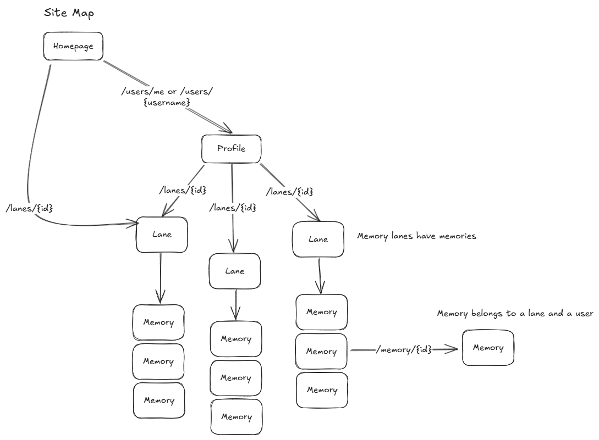
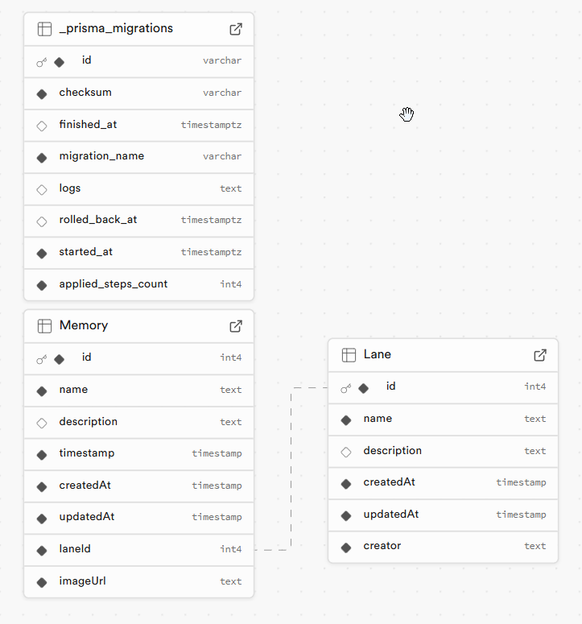

# Memory Lane

> **Note**: This project is built using the [T3 Stack](https://create.t3.gg/) and was bootstrapped with `create-t3-app`.

## Project Overview

The core idea behind *Memory Lane* was to create a website with a flow similar to this concept:

### Learning tRPC

One of my goals with this project was to get hands-on experience with tRPC, which had been on my list for a while. This project provided the perfect opportunity to dive in, and I must say, tRPC is fantastic—especially in combination with a Next.js setup.

### Tech Choices

I opted for Next.js over the Vite environment for a few key reasons:
- **Familiarity**: I have extensive experience with Next.js.
- **Convenience**: The T3 Stack simplifies the setup process by bootstrapping and integrating Next.js seamlessly with tRPC.

For the database, I chose **Prisma**, primarily due to my familiarity with it. Since I was already focused on learning tRPC for this project, I decided not to add the extra complexity of learning a new ORM, such as Drizzle (I remember you mentioned that you use that in-house). My main goal was to deploy this project in a dedicated environment (I used Vercel), allowing others to test it without the need to run it locally. If you'd like to try running it locally, feel free to reach out, and I can share my `.env` file.

### Session Management

Initially, I considered implementing a user model but ultimately decided to use a persisted local storage store that simulates an hour-long session by revoking the token after one hour. This approach allowed me to progress without needing to build a full authentication flow with JWTs, secrets, or OAuth. However, a user model and authentication system could be easily added if needed in the future.

### Data Models

The current app features two main models:
- **Lanes**: Collections that own memories.
- **Memories**: Individual records within lanes.

Since there is no user model, I’m saving the provided username directly via the API. While this isn't secure, the project’s primary goal was not user authentication but rather to showcase the concept. This can be enhanced later by introducing a user model and using an authentication solution like NextAuth to manage JWTs and sessions.

### UI and Animations

I utilized **shadcn** for UI components, which simplifies styling compared to manually working with Radix UI. While the design isn't particularly polished, it incorporates some good UX practices and could certainly be visually improved.

I also integrated **react-spring** to add animations and demonstrate my proficiency. Admittedly, some animations might feel a bit over-the-top, but they serve as examples for this demo.

### Deployment

For deployment, I used **Supabase** as the database and **Vercel Blob Storage** for image hosting. Having exhausted my free GCP credits, I opted for an all-Vercel setup, which has performed well so far.

### Future Improvements

The app could greatly benefit from a comprehensive redesign to establish a stronger visual identity. Due to time constraints, I wasn't able to create design concepts in Figma, so the current UI was developed through trial and error to find what worked best.

Currently, any user can edit another user's memories or lanes, as the only requirement for signing in is providing a username. Enhancing user authentication and access control would be a logical next step to improve security and user experience.

I chose not to implement multiple image uploads initially due to the added UI complexity (e.g., managing an array of images in a compact dialog, allowing users to reorder images, etc.). Additionally, handling potential issues like partial failures during batch uploads was outside the initial project scope. However, given more time, these features could be developed and integrated.

Additional features such as enabling users to like a memory or lane, and showcasing highlighted lanes of the week on the homepage, are also potential enhancements to enrich user engagement.

### Credits

Special thanks to **ChatGPT** for helping format this document and to **CoPilot** for assisting with the generation of various boilerplate code.